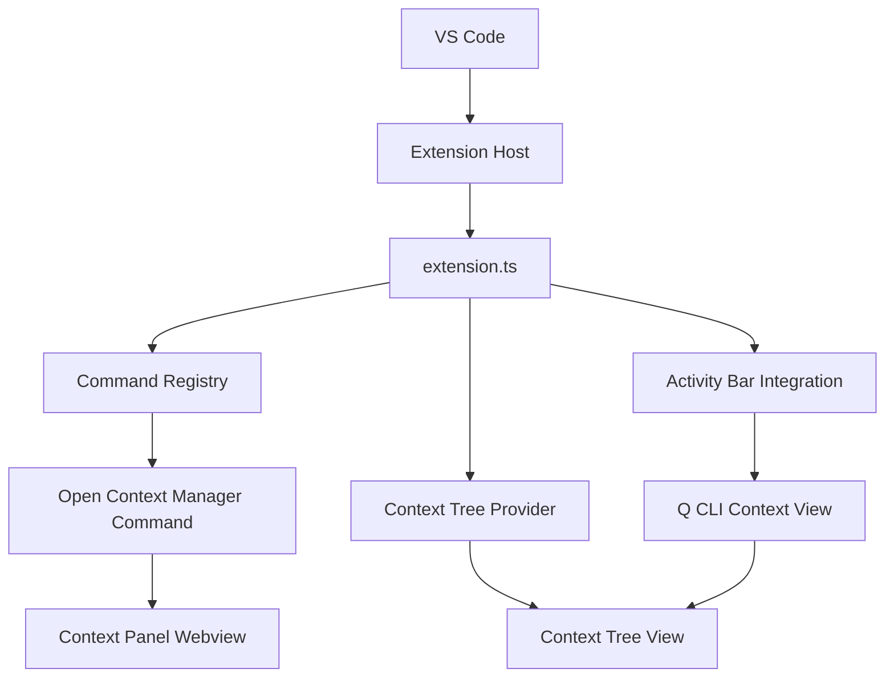

# 설계 문서

## 개요

Context Manager for Q CLI의 기본 VS Code Extension 윈도우를 구현하기 위한 설계입니다. 이 설계는 VS Code Extension API를 활용하여 Activity Bar 통합, 명령어 등록, 그리고 기본 사용자 인터페이스를 제공하는 견고한 기반을 구축합니다.

## 아키텍처

### 전체 아키텍처
```
VS Code Extension Host
├── Extension Entry Point (extension.ts)
├── Command Registry
├── Activity Bar Provider
├── Tree View Provider
└── Webview Provider (선택적)
```

### 컴포넌트 다이어그램


## 컴포넌트 및 인터페이스

### 1. Extension Entry Point (extension.ts)
익스텐션의 메인 진입점으로 활성화 및 비활성화를 관리합니다.

**주요 기능:**
- 익스텐션 활성화 시 모든 컴포넌트 초기화
- 명령어 등록 및 프로바이더 등록
- 리소스 정리 및 비활성화 처리

**인터페이스:**
```typescript
export function activate(context: vscode.ExtensionContext): void
export function deactivate(): void
```

### 2. Command Registry
VS Code 명령어 팔레트에서 사용할 수 있는 명령어들을 관리합니다.

**등록할 명령어:**
- `qcli-context.openContextManager`: Context Manager 패널 열기
- `qcli-context.refreshContext`: 컨텍스트 새로고침

### 3. Activity Bar Provider
VS Code Activity Bar에 Q CLI Context Manager 아이콘을 추가합니다.

**구성 요소:**
- 아이콘: Q CLI를 나타내는 커스텀 아이콘
- 뷰 컨테이너: "Q CLI Context" 제목
- 트리 뷰: 현재 컨텍스트 파일 목록 (기본 구현)

### 4. Context Tree Provider
Activity Bar의 사이드 패널에서 컨텍스트 정보를 트리 형태로 표시합니다.

**인터페이스:**
```typescript
interface IContextTreeProvider extends vscode.TreeDataProvider<ContextItem> {
    refresh(): void;
    getTreeItem(element: ContextItem): vscode.TreeItem;
    getChildren(element?: ContextItem): Thenable<ContextItem[]>;
}
```

### 5. Context Panel (Webview - 선택적)
명령어를 통해 열리는 메인 Context Manager 패널입니다.

**기능:**
- 환영 메시지 표시
- 기본 컨텍스트 정보 표시
- 향후 드래그 앤 드롭 기능을 위한 준비

## 데이터 모델

### ContextItem
트리 뷰에서 사용할 기본 컨텍스트 아이템 모델입니다.

```typescript
interface ContextItem {
    label: string;
    description?: string;
    iconPath?: vscode.ThemeIcon;
    contextValue?: string;
    children?: ContextItem[];
}
```

### ExtensionState
익스텐션의 전역 상태를 관리하는 모델입니다.

```typescript
interface ExtensionState {
    isActivated: boolean;
    contextItems: ContextItem[];
    outputChannel: vscode.OutputChannel;
}
```

## 오류 처리

### 활성화 오류
- 익스텐션 활성화 실패 시 VS Code 알림으로 사용자에게 알림
- 출력 채널에 상세한 오류 로그 기록
- 부분적 활성화 허용 (일부 기능만 사용 가능)

### 명령어 실행 오류
- 명령어 실행 실패 시 사용자 친화적 메시지 표시
- 오류 세부사항은 출력 채널에 로그
- 익스텐션 전체 기능에 영향 없도록 격리

### 로깅 전략
```typescript
enum LogLevel {
    DEBUG = 0,
    INFO = 1,
    WARN = 2,
    ERROR = 3
}

interface Logger {
    debug(message: string, ...args: any[]): void;
    info(message: string, ...args: any[]): void;
    warn(message: string, ...args: any[]): void;
    error(message: string, error?: Error): void;
}
```

## 테스트 전략

### 단위 테스트
- Extension 활성화/비활성화 테스트
- 명령어 등록 및 실행 테스트
- Tree Provider 데이터 제공 테스트

### 통합 테스트
- VS Code Extension Test Runner 사용
- 실제 VS Code 환경에서 익스텐션 로딩 테스트
- Activity Bar 통합 테스트

### 수동 테스트
- Extension Development Host에서 실제 사용자 시나리오 테스트
- 다양한 VS Code 테마에서 UI 확인
- 성능 및 메모리 사용량 모니터링

## 성능 고려사항

### 지연 로딩
- 익스텐션은 필요한 경우에만 활성화
- 무거운 작업은 사용자 요청 시에만 실행
- 메모리 사용량 최소화

### 활성화 최적화
- 동기적 작업 최소화
- 필수 컴포넌트만 즉시 초기화
- 백그라운드 초기화 작업 분리

### 리소스 관리
- 사용하지 않는 리소스 적절한 해제
- 이벤트 리스너 정리
- 메모리 누수 방지