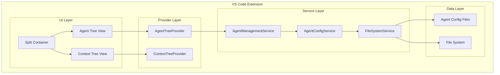
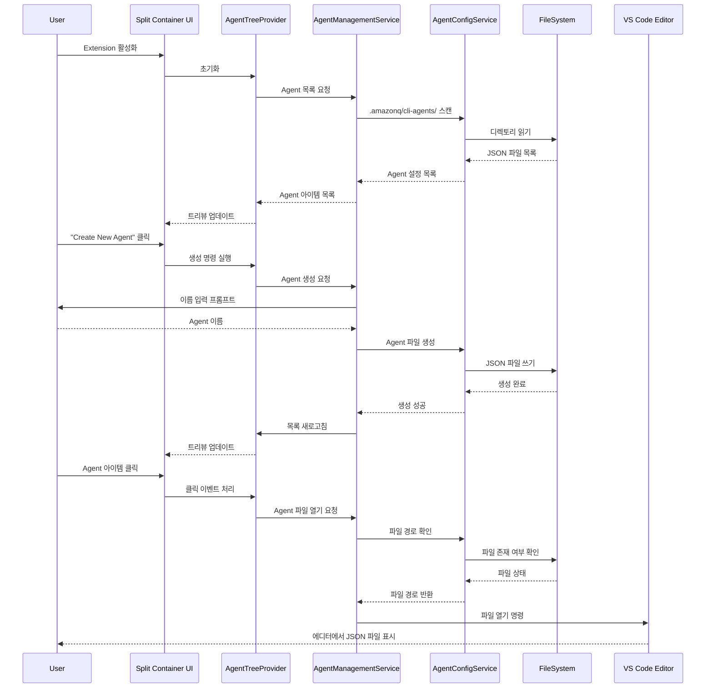

# Design Document

## Overview

이 설계는 VS Code 익스텐션에 Amazon Q CLI의 Local custom agents 관리 기능을 추가하는 것입니다. 기존의 단일 트리뷰 구조를 상하로 분할하여 상단에는 Agent 관리, 하단에는 기존 Context 관리 기능을 배치합니다. 사용자는 현재 프로젝트의 `.amazonq/cli-agents/` 디렉토리에 있는 agent 설정 파일들을 시각적으로 관리할 수 있습니다.

## Architecture

### High-Level Architecture



### Component Interaction Flow



## Components and Interfaces

### 1. UI Components

#### SplitViewContainer
기존 단일 트리뷰를 상하로 분할하는 컨테이너 역할을 합니다.

```typescript
interface ISplitViewContainer {
    // 상단 Agent 트리뷰와 하단 Context 트리뷰를 관리
    initializeViews(): Promise<void>;
    refreshAgentView(): void;
    refreshContextView(): void;
}
```

#### AgentTreeView
Agent 목록을 표시하는 상단 트리뷰입니다.

```typescript
interface IAgentTreeView {
    showAgents(agents: AgentItem[]): void;
    showCreateButton(): void;
    hideCreateButton(): void;
    onCreateAgent(): void;
    onAgentClick(agent: AgentItem): void;
}
```

### 2. Data Providers

#### AgentTreeProvider
Agent 트리뷰의 데이터를 제공하는 VS Code TreeDataProvider 구현체입니다.

```typescript
class AgentTreeProvider implements vscode.TreeDataProvider<AgentItem> {
    private _onDidChangeTreeData: vscode.EventEmitter<AgentItem | undefined | null | void>;
    readonly onDidChangeTreeData: vscode.Event<AgentItem | undefined | null | void>;
    
    private agentItems: AgentItem[];
    private agentManagementService: AgentManagementService;
    
    constructor(agentManagementService: AgentManagementService);
    
    getTreeItem(element: AgentItem): vscode.TreeItem;
    getChildren(element?: AgentItem): Thenable<AgentItem[]>;
    refresh(): void;
    updateAgentItems(items: AgentItem[]): void;
    addAgentItem(item: AgentItem): void;
    removeAgentItem(item: AgentItem): void;
    
    // Agent 클릭 처리
    handleAgentClick(agent: AgentItem): Promise<void>;
}
```

### 3. Service Layer

#### AgentManagementService
Agent 관련 비즈니스 로직을 처리하는 핵심 서비스입니다.

```typescript
interface IAgentManagementService {
    // Agent 목록 관리
    getAgentList(): Promise<AgentItem[]>;
    refreshAgentList(): Promise<void>;
    
    // Agent 생성
    createNewAgent(name: string): Promise<AgentCreationResult>;
    validateAgentName(name: string): ValidationResult;
    
    // Agent 파일 열기
    openAgentConfigFile(agent: AgentItem): Promise<void>;
    
    // Agent 파일 감시
    startFileWatcher(): void;
    stopFileWatcher(): void;
    
    // 이벤트 처리
    onAgentListChanged: vscode.Event<AgentItem[]>;
}

class AgentManagementService implements IAgentManagementService {
    private agentConfigService: AgentConfigService;
    private fileSystemService: FileSystemService;
    private fileWatcher?: vscode.FileSystemWatcher;
    private _onAgentListChanged: vscode.EventEmitter<AgentItem[]>;
    
    constructor(
        agentConfigService: AgentConfigService,
        fileSystemService: FileSystemService
    );
}
```

#### AgentConfigService
Agent 설정 파일의 읽기/쓰기를 담당하는 서비스입니다.

```typescript
interface IAgentConfigService {
    // 디렉토리 관리
    ensureAgentDirectory(): Promise<void>;
    getAgentDirectory(): string;
    
    // Agent 파일 관리
    scanAgentFiles(): Promise<string[]>;
    readAgentConfig(filePath: string): Promise<AgentConfig>;
    writeAgentConfig(name: string, config: AgentConfig): Promise<void>;
    deleteAgentConfig(name: string): Promise<void>;
    
    // 유효성 검사
    validateAgentConfig(config: AgentConfig): ValidationResult;
    isAgentNameExists(name: string): Promise<boolean>;
}

class AgentConfigService implements IAgentConfigService {
    private fileSystemService: FileSystemService;
    private logger: ExtensionLogger;
    
    constructor(fileSystemService: FileSystemService, logger: ExtensionLogger);
}
```

### 4. Data Models

#### AgentConfig
Q CLI Agent 설정 파일의 구조를 정의합니다.

```typescript
interface AgentConfig {
    $schema: string;
    name: string;
    description: string;
    prompt: string | null;
    mcpServers: Record<string, any>;
    tools: string[];
    toolAliases: Record<string, string>;
    allowedTools: string[];
    resources: string[];
    hooks: Record<string, any>;
    toolsSettings: Record<string, any>;
    useLegacyMcpJson: boolean;
}
```

#### AgentItem
트리뷰에 표시될 Agent 아이템의 구조입니다.

```typescript
interface AgentItem {
    label: string;
    description?: string;
    iconPath?: vscode.ThemeIcon | vscode.Uri;
    contextValue: string;
    filePath: string;
    config: AgentConfig;
    children?: AgentItem[];
    command?: vscode.Command; // 클릭 시 실행될 명령
}
```

#### AgentCreationResult
Agent 생성 작업의 결과를 나타냅니다.

```typescript
interface AgentCreationResult {
    success: boolean;
    message: string;
    agentItem?: AgentItem;
    error?: Error;
}

interface ValidationResult {
    isValid: boolean;
    errors: string[];
    warnings?: string[];
}
```

## Data Models

### Agent Configuration Schema

Q CLI Agent 설정 파일은 다음과 같은 JSON 스키마를 따릅니다:

```json
{
  "$schema": "https://raw.githubusercontent.com/aws/amazon-q-developer-cli/refs/heads/main/schemas/agent-v1.json",
  "name": "{agent-name}",
  "description": "Agent description",
  "prompt": null,
  "mcpServers": {},
  "tools": [
    "fs_read",
    "fs_write", 
    "execute_bash",
    "use_aws",
    "gh_issue",
    "knowledge",
    "thinking"
  ],
  "toolAliases": {},
  "allowedTools": ["fs_read"],
  "resources": [
    "file://README.md",
    "file://.amazonq/rules/**/*.md"
  ],
  "hooks": {},
  "toolsSettings": {},
  "useLegacyMcpJson": true
}
```

### File System Structure

```
workspace/
├── .amazonq/
│   └── cli-agents/
│       ├── agent1.json
│       ├── agent2.json
│       └── custom-agent.json
└── other-files...
```

## Error Handling

### Error Categories

1. **File System Errors**
   - 디렉토리 생성 실패
   - 파일 읽기/쓰기 권한 오류
   - 디스크 공간 부족

2. **Validation Errors**
   - 잘못된 Agent 이름 형식
   - 중복된 Agent 이름
   - 잘못된 JSON 구조

3. **Configuration Errors**
   - 스키마 검증 실패
   - 필수 필드 누락
   - 잘못된 도구 참조

4. **File Access Errors**
   - Agent 파일이 존재하지 않음
   - 파일 읽기 권한 없음
   - VS Code 에디터 열기 실패

### Error Handling Strategy

```typescript
class ErrorHandler {
    handleFileSystemError(error: Error, operation: string): void {
        // 파일 시스템 오류 처리
        // 사용자에게 친화적인 메시지 표시
        // 로그 기록
    }
    
    handleValidationError(errors: string[]): void {
        // 유효성 검사 오류 처리
        // 구체적인 오류 메시지 표시
        // 수정 방법 제안
    }
    
    handleConfigurationError(error: Error, configPath: string): void {
        // 설정 오류 처리
        // 설정 파일 복구 옵션 제공
        // 백업 생성
    }
    
    handleFileAccessError(error: Error, filePath: string): void {
        // 파일 접근 오류 처리
        // 파일 존재 여부 확인
        // 대안 제시 (파일 생성, 권한 요청 등)
    }
}
```

## Testing Strategy

### Unit Tests

1. **Service Layer Tests**
   - AgentManagementService 로직 테스트
   - AgentConfigService 파일 작업 테스트
   - 유효성 검사 로직 테스트

2. **Provider Tests**
   - AgentTreeProvider 데이터 변환 테스트
   - 트리뷰 상태 관리 테스트

3. **Utility Tests**
   - 파일 경로 처리 테스트
   - JSON 파싱/직렬화 테스트

### Integration Tests

1. **End-to-End Workflows**
   - Agent 생성 전체 플로우 테스트
   - 파일 시스템 감시 기능 테스트
   - UI 상호작용 테스트

2. **Error Scenarios**
   - 파일 시스템 오류 시나리오
   - 잘못된 입력 처리 테스트
   - 권한 오류 처리 테스트

### Mock Strategy

```typescript
// 테스트용 Mock 서비스
class MockFileSystemService implements IFileSystemService {
    private mockFiles: Map<string, string> = new Map();
    
    async readFile(path: string): Promise<string> {
        return this.mockFiles.get(path) || '';
    }
    
    async writeFile(path: string, content: string): Promise<void> {
        this.mockFiles.set(path, content);
    }
}
```

## Performance Considerations

### Memory Optimization

1. **Lazy Loading**
   - Agent 설정 파일은 필요할 때만 로드
   - 트리뷰 아이템은 가상화 사용

2. **Caching Strategy**
   - Agent 목록은 메모리에 캐시
   - 파일 변경 감지 시에만 새로고침

3. **Resource Management**
   - FileSystemWatcher 적절한 해제
   - EventEmitter 메모리 누수 방지

### File System Optimization

1. **Batch Operations**
   - 여러 파일 작업을 배치로 처리
   - 불필요한 파일 시스템 접근 최소화

2. **Debouncing**
   - 파일 변경 이벤트 디바운싱
   - UI 업데이트 빈도 제한

## Security Considerations

### File System Security

1. **Path Validation**
   - 디렉토리 탐색 공격 방지
   - 허용된 경로 외부 접근 차단

2. **Input Sanitization**
   - Agent 이름 입력 검증
   - JSON 파싱 시 안전성 확보

### Configuration Security

1. **Schema Validation**
   - 모든 Agent 설정 파일 스키마 검증
   - 악성 설정 차단

2. **Permission Checks**
   - 파일 읽기/쓰기 권한 확인
   - 사용자 권한 범위 내에서만 작업

## Migration Strategy

### Backward Compatibility

1. **Existing Extension**
   - 기존 Context 관리 기능 유지
   - 설정 호환성 보장

2. **Configuration Migration**
   - 기존 사용자 설정 보존
   - 새로운 기능 점진적 활성화

### Rollback Plan

1. **Feature Toggle**
   - Agent 관리 기능 비활성화 옵션
   - 기존 단일 뷰로 복원 가능

2. **Data Integrity**
   - Agent 파일 백업 생성
   - 실패 시 원본 상태 복원